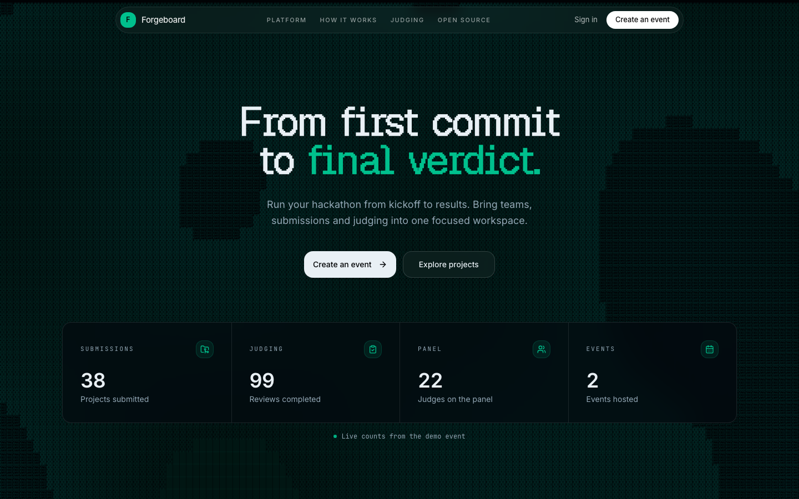
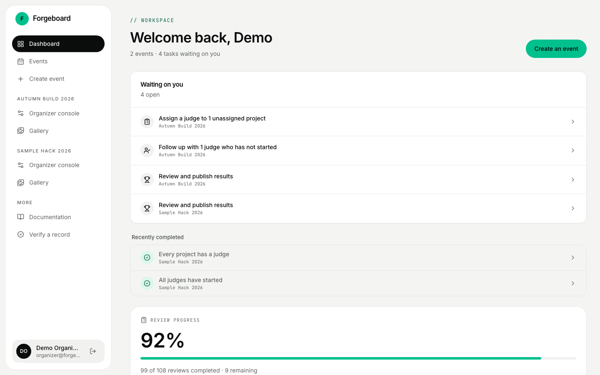
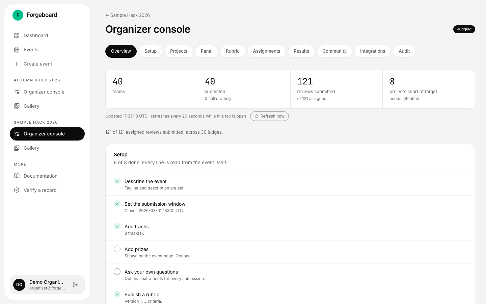
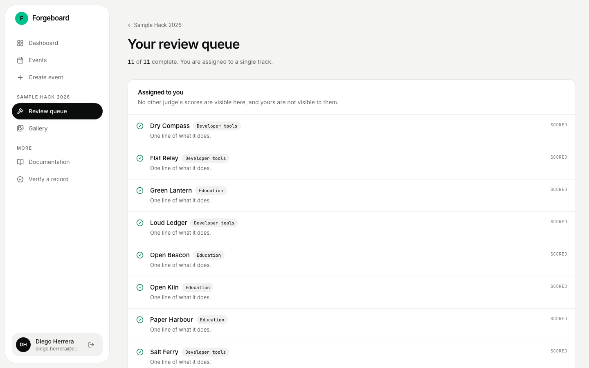
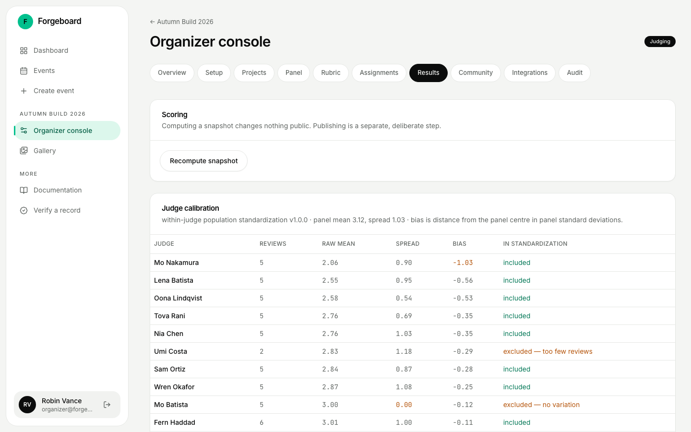
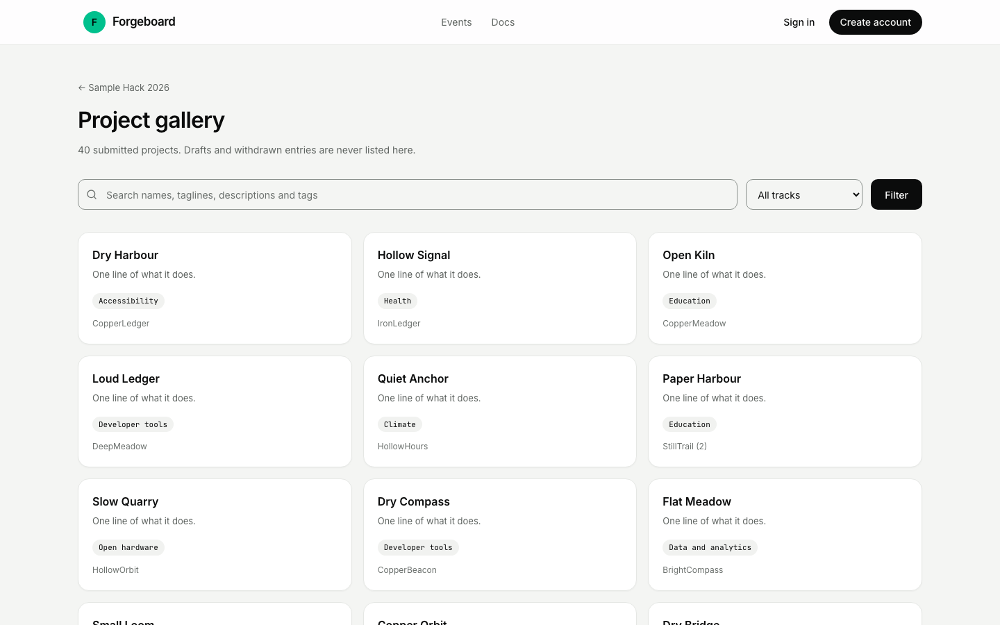

# Forgeboard

**From first commit to final verdict.**

A self-hostable hackathon submission and judging platform. Events, teams,
submissions, a public gallery, judge assignment, weighted rubrics, cross-judge
normalization and published results — in one product you run yourself.

---

## The official checker

`docker compose up` imports the DOGFOOD fixtures and prints four demo sign-ins; then

```bash
python3 run.py .dogfood.toml
```

prints **7 of 7 PASS**, `verified T1 T2`. `run.py` only has checks for T1 and T2, so T3 and T4
are verified by our own tests (below). The committed [`acceptance-report.txt`](acceptance-report.txt)
is that output.

| Check | Route in `.dogfood.toml` |
|---|---|
| Gallery is public and shows fixture projects | `/events/sample-hack-2026/gallery` |
| A closed event refuses submissions (409) | `POST /api/events/sample-hack-2026/projects` |
| A judge reads their own scores | `/api/judge/scores` |
| A judge cannot read a peer's scores (403) | `/api/judge/scores?judge=jdg_24` |
| A participant is not a judge (403) | `/api/judge/scores` |
| An organizer exports CSV | `/api/events/sample-hack-2026/export/reviews` |

---

## Run it

```bash
docker compose up
```

Then open <http://localhost:3000>. That applies the schema, applies any column
an older database is missing, seeds a demo event and serves the portal. There is no cloud account, managed database, auth
provider or runtime API key, and the application makes **no outbound network
requests at runtime** — fonts are vendored in the `geist` package and the
database is a file on a local volume.

To start empty instead of seeded, set `FORGEBOARD_SEED=0`.

### Without Docker

Requires **Node 24 or newer** — the database driver is the standard library's
`node:sqlite` (stable from Node 24; it works on 22.5+ but prints an
experimental warning), and password hashing is `node:crypto` `scrypt`.

```bash
npm install
npm run db:migrate
npm run db:seed
npm run dev
```

### Demo accounts

The seed creates 117 accounts. All of them share the password
**`forgeboard2026`** (one hash is computed and reused, so seeding stays fast;
real registrations always hash individually).

| Account | What it shows you |
|---|---|
| `organizer@forgeboard.local` | The organizer console: panel, rubric, assignments, calibration, results, audit |
| `judge@forgeboard.local` | A judge's own review queue, six projects, all scored |
| `participant@forgeboard.local` | A team and its submitted project |
| `admin@forgeboard.local` | Instance administration. It holds **no role in the demo event**, so you can see the audited admin override: it can still open the console, and the event's audit trail records that it did |

The seeded event `autumn-build-2026` is deliberately mid-flight: submissions
closed, judging under way, results computed but **not** published.

## What it looks like

| | |
|---|---|
|  |  |
| The public page, with counts read from this instance's own database | The workspace: what is waiting on you, then progress, then the event |
|  |  |
| Organizer overview: live counts, setup checklist, coverage gaps, judge progress | A judge's queue: only their own assignments |
|  |  |
| Judge calibration: every judge left out of normalization is named, with the reason | The searchable gallery a visitor sees |

Captured from the seeded demo event on this build.

## What the seed contains

It is not tidy, on purpose:

- 40 projects — 37 submitted, 2 still drafting, 1 withdrawn
- 21 judges, two of them restricted to a single track
- one judge who scores **everything a 3**
- one judge who never started, one who left half a batch in draft, and one with
  only two reviews (too few to calibrate, so excluded from normalization)
- one submitted project with **no assignments at all**, so the coverage gap is visible
- 99 submitted reviews, 3 still in draft

## Tiers reached

| Tier | State | Notes |
|---|---|---|
| **T1 — Core** | Complete | Auth with local password recovery, five roles, an event setup screen (dates, timezone, tracks, prizes, custom questions of five kinds, a checklist read from stored data), invite-link teams, draft-and-edit submissions, server-enforced deadlines, searchable public gallery |
| **T2 — Judging** | Complete | Scoped single-use judge invitation links, judge removal that keeps submitted work, previewed batch assignment, organizer-configurable weighted rubrics, backend role and track isolation, eligibility decisions, polled progress with a stale indicator, documented normalization, CSV at every stage |
| **T3 — Public** | Complete, verified | Three voting access modes, per-voter randomised ballots, hidden totals until closed and published, rate limits, duplicate prevention by unique index, audited invalidation, comments with moderation. Email-gated voting issues one-use expiring tokens, handed to voters by the organizer like every other Forgeboard link, so no mail server is needed. |
| **T4 — Stretch** | Complete, verified | All six T4 items in the spec: a REST API (14 operations, OpenAPI 3.1, scoped API keys), signed webhooks (SSRF-guarded, bounded retries), certificates of judging participation, verifiable judge records (Ed25519, checked on a public page without an account), an embeddable gallery, and bulk import and export of a whole event. Checked live by `tests/t4-live.sh` (10 of 10) and by the stretch unit tests. |

Bonus attempted: **Threat Model** (see `THREAT-MODEL.md`). The normalization
work in `JUDGING.md` goes beyond what T2 requires and is evidenced on the
seeded data, but it is claimed as part of T2 rather than as a separate bonus.

## What is verified, and what is not

Honest accounting of the evidence behind the claims above:

**Verified on this machine**

- `npm test` — **131 tests pass, 0 fail**
  - 20 scoring/maths (`MATH-01…07`), including the hand-checks **4.05 / 76.25** and **±1.224744871**
  - 21 backend behaviour (isolation, deadlines, gallery, results, teams, exports)
  - 27 T3 community (`VOTE-01…09`, `COMMENT-01…02`, `COMMUNITY-01`)
  - 28 T4 stretch (signing, tamper rejection, portability round trip and import score validation, webhook SSRF)
  - 35 governance (rubric validation, event windows, question options, judge invitations, judge
    removal, conflict history, eligibility, assignment preview, audited admin
    override, password recovery)
- `tests/t4-live.sh` against the running instance — **10 of 10 T4 checks pass**: the API root and
  its OpenAPI 3.1 document, the public events list, organizer data refused without a login, the
  whole-event bundle export (with no password hashes in it), a dry-run import of that bundle, the
  embeddable gallery, the published signing key and the no-account verify page
- `npm run build` — production build succeeds, no type errors
- Every page renders against the seeded database
- The authorization matrix, over real HTTP with real session cookies:

  | Path | organizer | judge | participant | anonymous |
  |---|---|---|---|---|
  | `/events/:slug/organize*` | 200 | 404 | 404 | 307 → sign in |
  | `/events/:slug/judge` | 404 | 200 | 404 | 307 → sign in |
  | another judge's `/judge/:assignmentId` | — | **404** | — | — |
  | `/api/events/:slug/export/reviews` | 200 | **403** | **403** | **403** |
  | `/api/v1/events/:slug/reviews` | 200 | **403** | **403** | **403** |
  | `/api/v1/events/:slug/export` (bundle) | 200 | **403** | **403** | **403** |
  | `/api/v1/events/:slug/results` (unpublished) | 200 | — | — | **404** |

  The refused attempt is written to the event's audit trail with the actor and
  the reason.
- `/embed/*` is frameable; every other route sends `X-Frame-Options: DENY`.
- No outbound network call in application code at runtime (grep-verified); the
  three fonts ship inside the `geist` package.

- **`docker compose up` works, from a clean slate.** `docker compose down -v`
  then `docker compose up -d` reaches a passing healthcheck in **1.2–1.6 seconds**
  across four runs, seeded with the demo event. Full transcript in [`VERIFICATION.md`](VERIFICATION.md).
- **It runs with the network off.** A container started with `--network none`
  — no IP address at all — comes up seeded and serves every public route.
  Outbound requests time out, proving the isolation is real. The served HTML
  contains **0** Google Fonts references and 5 locally served font files.
- **Restart preserves data and does not re-seed.** A non-seed row survives a
  restart; the user count does not double; the seed reports
  "already present; nothing to do".
- **The interface was driven in a real browser.** Headless Chrome over the
  DevTools Protocol runs the whole lifecycle — register, create and configure an
  event, invite a judge, form a team, fail a submission, fix it, submit, judge,
  disqualify, reinstate, recover a password — plus axe-core (**0 serious or
  critical violations across 15 screens**), keyboard and focus checks, and a
  width sweep at 320/390/720/1024/1440 with no horizontal overflow.
  [`TESTING.md`](TESTING.md) lists the commands; [`VERIFICATION.md`](VERIFICATION.md)
  holds the transcripts.


## Documentation

| File | Contents |
|---|---|
| `ARCHITECTURE.md` | Components, trust boundaries, request lifecycle, decisions and their alternatives |
| `DATA-MODEL.md` | Every table, constraint and state machine; import, export and recovery |
| `JUDGING.md` | Assignment strategy, the scoring maths, normalization, edge cases and limits |
| `THREAT-MODEL.md` | Attacks stopped, attacks not stopped, and why |
| `TESTING.md` | Test layers, the exact commands, and what each proves |
| `VERIFICATION.md` | Every check actually run, with transcripts |
| `DEMO-SCRIPT.md` | A five-minute walkthrough tied to the seeded data |

## Design notes

- **No mail server to run.** Team invites, judge invitations, voting tokens and
  password recovery each produce a one-use link the organizer passes along. An
  admin issues a recovery link from `/admin`, or the operator runs
  `npm run user:reset -- someone@example.org` on the server (in Docker,
  `docker compose exec forgeboard node scripts/reset-password.ts …`).
- **One SQLite file.** The whole instance is one database file and a key file on
  the volume, so backup is a copy. `DATA-MODEL.md` documents the Postgres path.

## Licence

MIT. See `LICENSE`.
