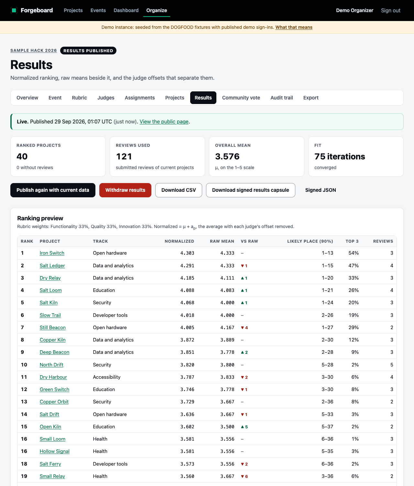
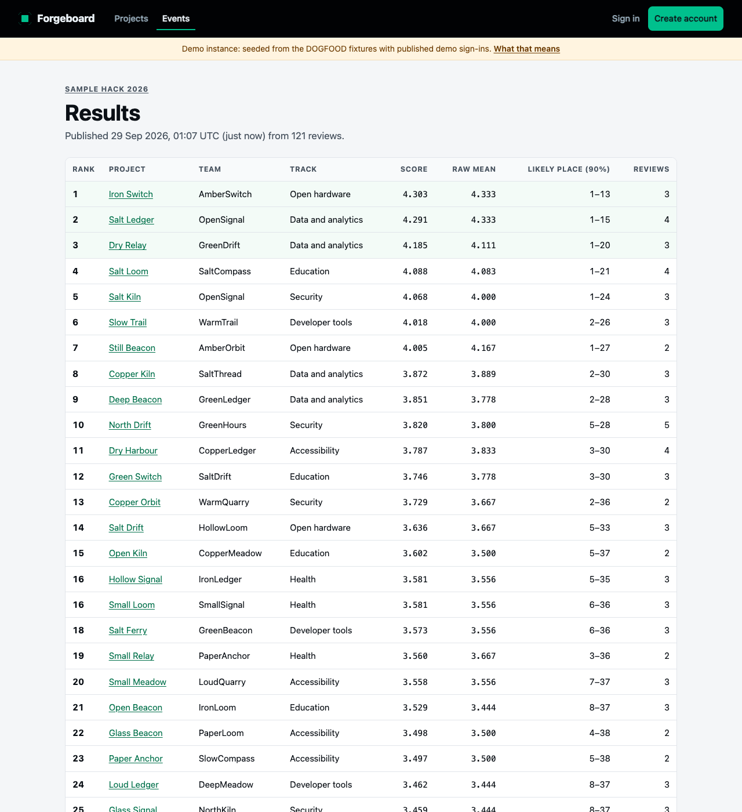
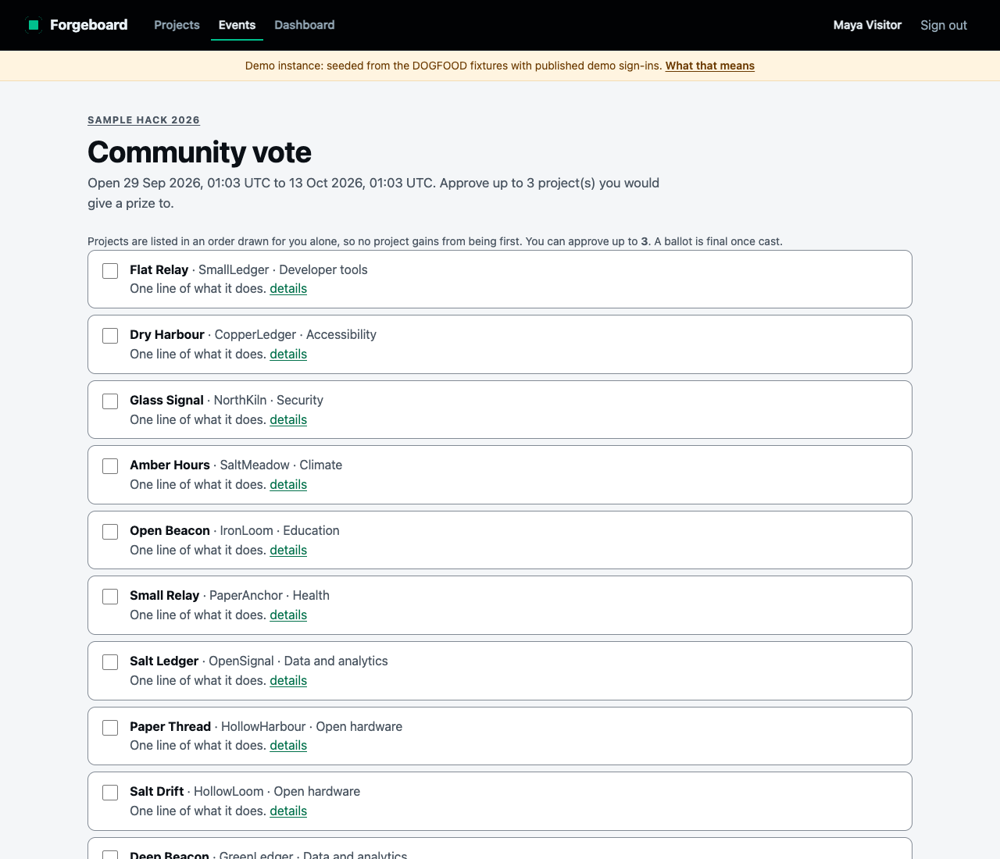
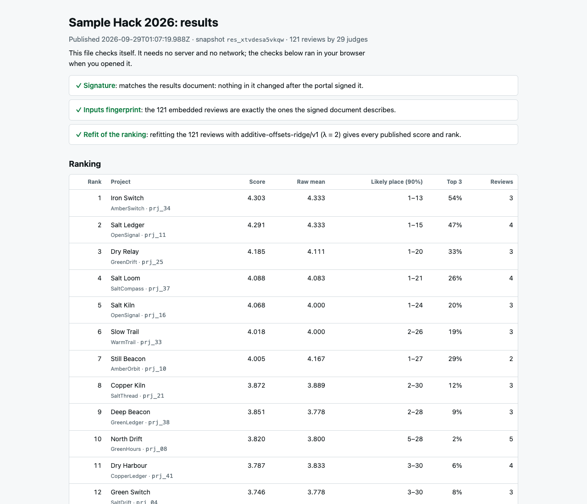
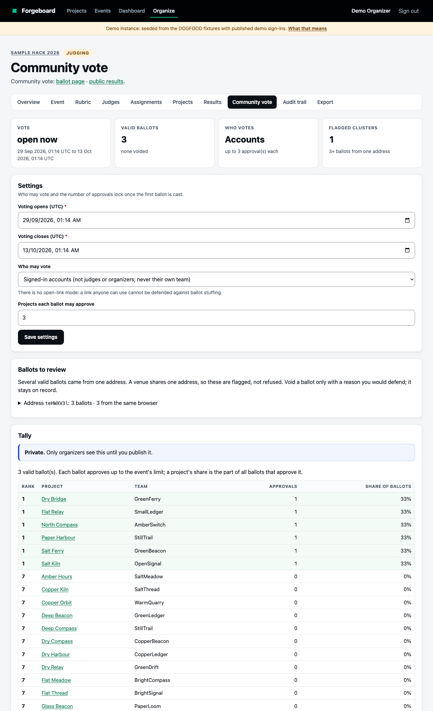
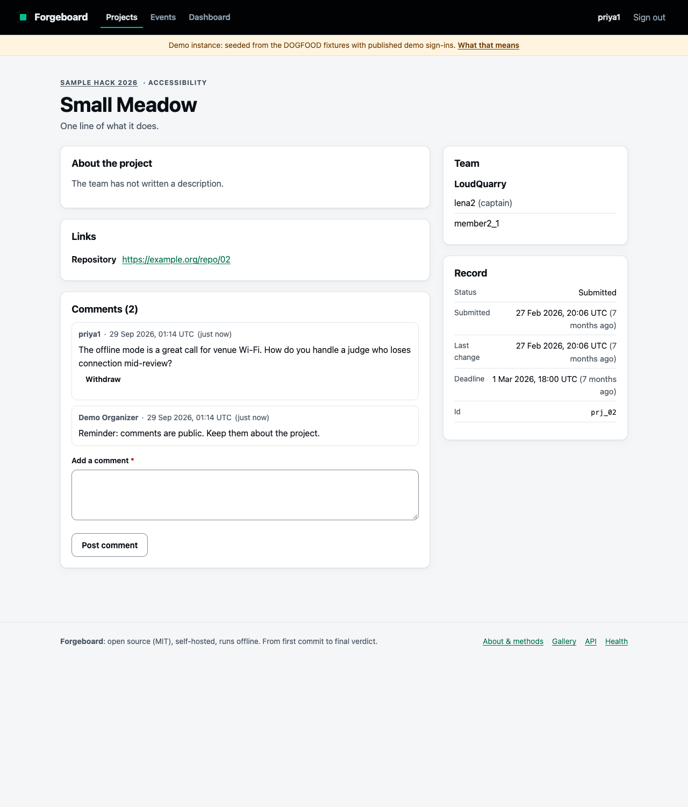
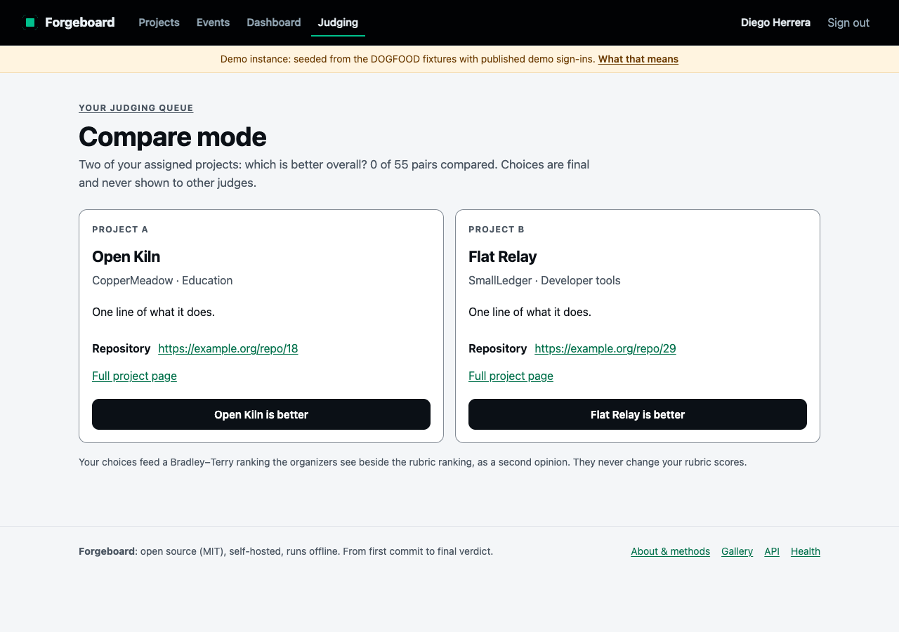

# Forgeboard

**A self-hosted hackathon submission and judging portal that enforces its own rules.** Teams
submit before a deadline that actually holds. Judges score against a weighted rubric and never
see each other's work: the backend refuses, not the template. The ranking corrects for harsh and
generous judges with a method that is written down, tested, and chosen by simulation on the
DOGFOOD fixture data.

| | |
|---|---|
| **Tiers** | Claims **T1 and T2**. The official checker says `claimed T1 T2, verified T1 T2` ([`acceptance-report.txt`](acceptance-report.txt)). **T3 is built too**: community voting, comments, hidden results, shuffled ballots and anti-abuse, checked by [`scripts/t3_check.py`](scripts/t3_check.py): 15 of 15 ([`acceptance-report-t3.txt`](acceptance-report-t3.txt)). It is recorded as evidence, not claimed, because the official checker has no T3 checks ([why](#why-t3-is-evidence-not-a-claim)) |
| **One command** | `docker compose up`: seeded with the DOGFOOD fixtures, works with the network off |
| **Dependencies** | **Zero at runtime.** Node 24's standard library (`node:http`, `node:sqlite`, `node:crypto`). No `npm install`, no build step |
| **Tests** | **1,651 of our own, all passing** (`npm test`, about 20 s), including **one test per rule** on the spec page. With the official checker (7), our T3 checker (15) and a headless browser pass (16), that is **1,689 automated checks**, plus a network-off proof, all rerun by CI on every push. [How we tested](#how-we-tested) |
| **Judging** | Weighted rubric, backend isolation, live dashboard, **additive judge offsets with ridge shrinkage** ([JUDGING.md](JUDGING.md)), **90% rank intervals and podium stability**, a **pairwise Bradley–Terry second opinion** with a judges' **compare mode**, CSV at every stage |
| **Evidence** | Published results are **signed (Ed25519)** and ship as a **self-verifying capsule** that refits the ranking in any browser, offline. The audit trail is **hash-chained**, and the method is **fixed when the first score arrives** |
| **Bonus work** | Normalization Proof ([JUDGING.md §3](JUDGING.md#3-normalization-correcting-for-harsh-and-generous-judges)), Pairwise Mode ([JUDGING.md](JUDGING.md#a-second-opinion-pairwise-with-bradleyterry)), Threat Model ([THREAT-MODEL.md](THREAT-MODEL.md)) and API First: every UI action is an API call, all 44 in [`/api/openapi.json`](#api-first-every-ui-action-is-an-api-call), held to the router and to every form by a test |
| **Licence** | MIT |

| | |
|---|---|
|  |  |
| **Results, with how sure they are.** Normalized next to raw, a 90% range for every place, and the top-three share | **Public results you can check.** Signature valid, method unchanged since scoring began, and a signed JSON download |
|  |  |
| **The community vote.** Each voter sees their own order and approves up to three projects | **The results capsule, opened with no server.** It checks its own signature, its inputs and a refit of the ranking |

## Contents

1. [Evaluate it in ten minutes](#1-evaluate-it-in-ten-minutes)
2. [Demo accounts and what to try](#2-demo-accounts-and-what-to-try)
3. [What it does](#3-what-it-does)
4. [Who can see what: backend-enforced isolation](#4-who-can-see-what-backend-enforced-isolation)
5. [Judging integrity in one page](#5-judging-integrity-in-one-page)
6. [How it is built](#6-how-it-is-built)
7. [Verification: what we ran and what it said](#7-verification-what-we-ran-and-what-it-said), including [how we tested](#how-we-tested)
8. [Running it for a real event](#8-running-it-for-a-real-event)
9. [Getting data in and out](#9-getting-data-in-and-out)
10. [Developing without Docker](#10-developing-without-docker)
11. [Troubleshooting](#11-troubleshooting)
12. [Where to look, by scoring criterion](#12-where-to-look-by-scoring-criterion)
13. [Honest limitations](#13-honest-limitations)
14. [Documents in this repository](#14-documents-in-this-repository)

---

## 1. Evaluate it in ten minutes

### Step 0: what you need

| Tool | Why | Check |
|---|---|---|
| Docker with Compose v2 (Docker Desktop, or Docker Engine plus the compose plugin) | Runs the portal | `docker compose version` |
| Python 3, any version | Runs the official `run.py` checker (standard library only) | `python3 --version` |
| Port **8080** free | The portal listens there, and `.dogfood.toml` points there | `lsof -i :8080` shows nothing |

The only thing Docker downloads is the `node:24-alpine` base image. There is no `npm install` in
the image, so once that base image is on the machine, the portal builds and runs with the network
off. To prepare a laptop for an offline evaluation, run this once while online:

```sh
docker pull node:24-alpine
```

### Step 1: start the portal

```sh
git clone https://github.com/Avi36005/DogFood-2026.git forgeboard
cd forgeboard
docker compose up
```

The first start imports `fixtures.json` and prints the sign-ins the checker uses:

```text
Forgeboard is listening on http://localhost:8080
imported evt_01 from fixtures.json: 41 projects, 40 teams, 30 judges, 126 scores
  duplicate submission: prj_07 replaced by prj_41 (team tm_07)
  note: teams tm_03, tm_30, tm_40 share a name; they have different members, so they are kept as separate teams
  note: teams tm_05, tm_34 share a name; they have different members, so they are kept as separate teams
  note: teams tm_11, tm_16 share a name; they have different members, so they are kept as separate teams

seeded. test logins:
  organizer    Cookie: session=org_demo_7f2a9c41d8e3b6a5
  judge_a      Cookie: session=jdg_a_demo_91bc5e0f27d4a8c3
  judge_b      Cookie: session=jdg_b_demo_44de83a1c9f06b72
  participant  Cookie: session=prt_demo_2e88b7d14c6f3a19

demo accounts (password "forgeboard-demo"):
  admin        admin@forgeboard.local
  organizer    organizer@forgeboard.local
  judge_a      diego.herrera@example.org
  judge_b      ines.rocha@example.org
  participant  priya1@example.org

DEMO MODE: these sign-ins are public. Never enable FORGEBOARD_DEMO on an instance with real data.
```

The import notes are the fixture's awkward cases being handled on purpose (see
[section 5](#5-judging-integrity-in-one-page)). Open **http://localhost:8080**.

### Step 2: run the official checker

In a second terminal, from the repository root:

```sh
python3 run.py .dogfood.toml
```

```text
DOGFOOD 2026 acceptance report
portal: http://localhost:8080
claimed: T1 T2
fixtures: fixtures.json

T1  gallery is public ................. PASS
T1  project from fixtures shown ....... PASS
T1  closed event refuses submissions .. PASS
T2  judge sees own scores ............. PASS
T2  judge cannot see peer scores ...... PASS
T2  participant blocked ............... PASS
T2  csv export works .................. PASS

claimed T1 T2, verified T1 T2
```

`run.py` and `fixtures.json` are the organizers' published files, unmodified (sha256 prefixes
`aa98963841bc8e18` and `252896bc45d49fca`). The committed
[`acceptance-report.txt`](acceptance-report.txt) is this output.

### Step 3: try to break the isolation yourself

The checker's most important check, by hand. Judge B asks for judge A's scores:

```sh
curl -i -H 'Cookie: session=jdg_b_demo_44de83a1c9f06b72' \
  'http://localhost:8080/api/judge/scores?judge=jdg_24'
```

```text
HTTP/1.1 403 Forbidden        (headers trimmed)
{ "error": "You can read only your own scores. Another judge's scores are visible to organizers only.", "status": 403 }
```

The refusal is decided from judge B's roles *before* judge A is looked up, so the same 403 comes
back for a judge id that does not exist. It is also written to the event's audit trail. More to try:

```sh
# Judge A reads their own scores: 200 and JSON
curl -H 'Cookie: session=jdg_a_demo_91bc5e0f27d4a8c3' http://localhost:8080/api/judge/scores

# A participant is not a judge: 403
curl -i -H 'Cookie: session=prt_demo_2e88b7d14c6f3a19' http://localhost:8080/api/judge/scores

# A late submission is refused for being late: 403 "Submissions for Sample Hack 2026 closed on 1 Mar 2026, 18:00 UTC."
curl -i -X POST -H 'Cookie: session=prt_demo_2e88b7d14c6f3a19' -H 'Content-Type: application/json' \
  -d '{"title":"late","summary":"x"}' http://localhost:8080/projects/new

# The organizer exports each judge's reviews, mean, fitted offset and flags as CSV
curl -H 'Cookie: session=org_demo_7f2a9c41d8e3b6a5' 'http://localhost:8080/api/export.csv?kind=judges'

# Every JSON endpoint, described by the server itself
curl http://localhost:8080/api
```

Then sign in as the organizer and open **Sample Hack 2026 → Audit trail**. The refused attempts
you just made are there, in plain sentences.

### Step 4: run our tests, with nothing but Docker

```sh
docker run --rm -v "$PWD":/app -w /app node:24-alpine npm test
```

```text
ℹ tests 1651
ℹ pass 1651
ℹ fail 0
```

It takes about 20 seconds. The tests start their own servers on random ports with throwaway
databases, so they never touch the running portal or its data.

### Step 5: prove the network-off rule (optional)

```sh
sh scripts/offline-check.sh
```

```text
1. building with --network none
2. starting a container with --network none
3. checking from inside the container
   health: ok
   gallery projects: 40
   judge_a scores: 11
   csv header: rank,project_id,title,team,track,reviews,raw_mean,normalized_score,raw_rank,low_coverage,status
   egress: none, as intended
offline check passed
```

It builds the image with networking disabled and runs it in a container with no network interface.
Then it confirms from inside that the portal seeded itself and serves the gallery, judge scores
and CSV, and that an outbound request fails.

### Step 6: walk one full event lifecycle

[DEMO-SCRIPT.md](DEMO-SCRIPT.md) is a click-by-click, five-minute run: create an event, form a
team, submit, invite a judge, close submissions, auto-assign, score, publish and export. Start it
on a clean volume so the timestamps are fresh:

```sh
docker compose down -v && docker compose up
```

---

## 2. Demo accounts and what to try

Every demo account's password is `forgeboard-demo`. Use one private window per person, or sign
out and back in.

| Role | Sign in as | What to try |
|---|---|---|
| **Administrator** | `admin@forgeboard.local` | **Events → Create an event** with a deadline ten minutes away, then run the whole lifecycle on it |
| **Organizer** | `organizer@forgeboard.local` | Sample Hack 2026: the live **Overview**, **Rubric** weights, **Assignments → Fill gaps automatically**, **Results** (raw vs normalized, rank intervals, publish and download the signed capsule), **Community vote** (the private tally, ballot clusters, voter codes), **Audit trail**, **Export** |
| **Judge A** | `diego.herrera@example.org` (`jdg_24`, 11 reviews) | The judging queue, the scoring form (arrow keys move between scores), and **Compare mode**: which of two of your projects is better |
| **Judge B** | `ines.rocha@example.org` (`jdg_29`, shares no project with judge A) | Open one of judge A's review URLs: 403 |
| **Participant** | `priya1@example.org` (captain of NorthKiln, "Glass Signal") | The team page; the closed event refuses every change, by page and by API. **Vote** in the open community vote (your own project is on the ballot but cannot be picked), and comment on a project |
| **Visitor** | nobody | The gallery: search, event and track filters and ordering, all in the URL so they can be shared |

---

## 3. What it does

### Tier 1: core

| Requirement | How Forgeboard does it |
|---|---|
| Authentication and sessions | Email and password hashed with scrypt. Server-side sessions: the database stores only a SHA-256 of the cookie. Sign-out ends a session at once, a password change ends every other session, and sign-in is rate limited |
| A real role model | Visitor, participant, judge and organizer **per event**, plus an instance administrator. The same account can compete in one event and judge another. A judge cannot be on a team in the event they judge, and an organizer cannot judge it |
| Events with dates, tracks and prizes | Administrators create events with opening, deadline and judging-close times (UTC), tracks, prizes (optionally per track), a team size limit and a target number of reviews per project |
| Teams by invite link | A captain creates a team and shares a link. The link works for several people until the team is full, expires after 14 days, and stops working when the captain makes a new one. Only a hash of it is stored |
| Draft and edit until the deadline | Drafts are private: 404 to everyone except the team and the event's organizers. Submitted projects are public and editable until the deadline. Concurrent edits by teammates get a 409 instead of silently overwriting each other, and every save goes into an append-only revision history |
| A deadline that holds | Every write that touches a team or a project checks the **server clock inside the same transaction** as the write, for pages and the JSON API alike. A late request is refused *for being late*, whatever else is wrong with it. The client's clock is never consulted |
| Public gallery with search and filter | Server-rendered, so the fixture titles are in the HTML curl receives. Search, event and track filters, and ordering, all shareable by URL. All 40 fixture projects are on page one |

### Tier 2: judging

| Requirement | How Forgeboard does it |
|---|---|
| Judge invitation and assignment | One-time invite links, since there is no mail server. Judges cover chosen tracks. **Auto-assign** is track-aware and conflict-free, balances load, and serves the least-covered projects first. It reports anything it could not fill, and why. Manual assign and unassign are there too |
| A weighted rubric the organizer configures | Criteria with relative weights and a score scale. Criteria and scale lock once the first score exists; weights stay adjustable, and every change is audited with its before and after values |
| Backend role isolation | A judge's queries are keyed on the caller's own id. Other judges' scores and review pages return **403**, decided before the target is looked up, and the attempt lands on the audit trail. See [section 4](#4-who-can-see-what-backend-enforced-isolation) |
| Live organizer dashboard | Refreshes every 10 seconds: submissions, reviews done, coverage per project and per track, each judge's progress, and flags ("identical scores", "same total", "few reviews", "harsh", "generous") |
| Normalization, documented | Additive judge offsets with ridge shrinkage (λ = 2), chosen by simulation on the fixture's own judge layout. Raw means always sit beside normalized scores. See [section 5](#5-judging-integrity-in-one-page) and [JUDGING.md](JUDGING.md) |
| CSV export | At every stage: results, reviews, projects, judges, assignments and the audit trail. Cells a spreadsheet would run as formulas are neutralized |

**Also built:** publishing freezes a snapshot (method, λ, weights, every rank and every judge
offset), so a published ranking can be reproduced later. Republishing supersedes a snapshot
without deleting it. The audit trail is readable by an organizer without a database client and is
append-only *in the database*: triggers reject `UPDATE` and `DELETE`.

### Tier 3: public

Built and tested, recorded as evidence rather than claimed (see below). Demo mode opens a vote
for two weeks from first boot, so all of it can be tried at once.

| Requirement | How Forgeboard does it |
|---|---|
| Community voting with configurable access | **Approval voting with a budget**: each ballot approves up to N projects (3 by default), which a loud minority cannot split or stack. Two access modes: **signed-in accounts**, or **one-time voter codes** the organizer prints for the venue, our offline answer to "email-gated" (no mail server, one code is one ballot, stored only as a hash). No open-link mode: a link anyone can use cannot be defended |
| Comments on gallery projects | Any signed-in account comments on a public project. Authors can withdraw; organizers hide with a written reason. Hidden comments stay on record, marked, for organizers. Escaped everywhere, rate limited per account |
| Results hidden during voting | The tally is visible **only to organizers**, in the backend (pages and `GET /api/events/{id}/vote` alike), until voting has closed **and** an organizer publishes it after reviewing the ballots |
| Randomised ballot order | Every voter gets their own order: a Fisher–Yates shuffle seeded from an HMAC of the event and the voter. Stable on reload, so reloading cannot fish for a position; different between voters. A test checks each of 8 projects leads about 1 in 8 of 4,000 simulated ballots |
| Anti-abuse that means something | The window is checked on the server clock inside the ballot's transaction. **One ballot per account and per code** (unique indexes); **picks are final** (triggers). Judges and organizers cannot vote; nobody can approve their own team's project. Wrong codes are limited per address (only failures count, so a venue behind one address is never throttled), and ballots have a flood limit. Ballots from one address are **grouped for review** (flagged, not refused, since a venue shares one address), and an organizer can **void** a ballot with a reason. Every cast, refusal, void and publication is on the audit trail, and every ballot is in the `votes` CSV |

| | |
|---|---|
|  |  |
| **The organizer's view.** Settings that lock once voting starts, ballots from one address grouped for review, and a tally only organizers see until they publish | **Comments.** Signed-in, escaped, rate limited; authors withdraw, organizers hide with a reason |

#### Why T3 is evidence, not a claim

`run.py` has checks for T1 and T2 only, so any report that claims T3 ends with
`note: claimed but not verified: T3`. We keep `.dogfood.toml` at `claimed = ["T1", "T2"]`, the
tiers the official receipt can prove, and give T3 its own receipt in the same format:
`python3 scripts/t3_check.py .dogfood.toml` against `docker compose up` prints 15 checks, committed
as [`acceptance-report-t3.txt`](acceptance-report-t3.txt), and `tests/http/community.test.ts` covers
the rest. If the organizers prefer T3 in the claim, it is one line.

**Not built:** T4's webhooks, certificates and embeddable gallery. Signed, verifiable results and
the JSON API cover part of it. See [section 13](#13-honest-limitations).

---

## 4. Who can see what: backend-enforced isolation

Every cell below is asserted by [`tests/http/matrix.test.ts`](tests/http/matrix.test.ts), which
sends real requests as each role and checks the status code.

| Actor | Own scores | Another judge's scores | Another judge's review page | Organizer dashboard and results preview | Audit trail and CSV exports |
|---|---|---|---|---|---|
| Visitor | 401 | 401 | sent to sign-in | sent to sign-in | 401 (API), sign-in (pages) |
| Participant | 403 | 403 | 403 | 403 | 403 |
| Judge | **200** | **403**, audited | **403** | 403 | 403 |
| Organizer of that event | n/a (organizers do not judge) | 200, read-only | 200, read-only | 200 | 200 |
| Administrator | n/a (administrators do not judge) | 200, read-only, **audited** | 200, read-only, **audited** | 200, **audited** | 200, **audited** |

This is the organizers' published matrix (FIG. 02): judges see only their own scores; organizers
and administrators see everything in an event. We add one thing: an administrator who is not an
organizer of the event leaves an `admin.access` entry on **that event's** audit trail every time
they use those powers ("Demo Admin used administrator access (not an organizer of this event) to
read the scores of jdg_03"), so the override is never silent. The matrix test checks the entries.

What makes these hold:
- **Authorization lives in the domain layer, not in routes or templates.** Every page, the JSON
  API and the tests call the same domain functions, and each one starts with the check it needs.
  A route that forgot a check could not leak, because the function it calls refuses the caller.
- **A judge's queue is `WHERE a.judge_id = <the caller>`.** There is no parameter to ask for
  somebody else's. Auto-assign only gives a judge projects in the tracks they cover.
- **No existence oracle.** A 403 says nothing about whether the requested judge or review exists.
- **Organizers cannot score on a judge's behalf.** A `POST` to another judge's review is 403 for
  everyone, organizers included.
- **Refusals are recorded after the transaction rolls back,** so a denied write can never take its
  own audit entry down with it.

---

## 5. Judging integrity in one page

### The method

Each review's score is the weighted mean of its criterion scores. Forgeboard then fits one model to
every submitted review of the current projects:

$$ x_{jp} = \mu + a_p + b_j + \varepsilon_{jp}, \qquad \min_{a,b} \sum (x_{jp} - \mu - a_p - b_j)^2 + \lambda \sum_j b_j^2, \quad \lambda = 2 $$

Here a<sub>p</sub> is how good project *p* is, and b<sub>j</sub> is how generous judge *j* is.
Projects are ranked by **μ + a<sub>p</sub>**: their score with each judge's offset taken out, on
the same 1–5 scale as the raw mean shown beside it. The ridge term treats every judge as if they
had also filed two unbiased reviews. A judge seen once is barely moved, and a judge seen eleven
times is corrected almost fully. The fit is convex, deterministic (the same reviews give the same
bits in any order) and converges in 75 iterations on the fixture. The full derivation, a worked
example you can check by hand, and the stated limits are in [JUDGING.md](JUDGING.md).

### Why this method: the evidence

We did not pick it by taste. [`research/normalization-study.ts`](research/normalization-study.ts)
keeps the fixture's exact judge–project layout (121 reviews, 40 projects, 29 judges), invents a
known true quality for each project and a bias for each judge, and checks each method's ranking
against the truth over 300 simulated events per scenario. It is seeded, so `npm run study`
reproduces [its output](research/normalization-study-output.md) exactly.

| Method | Judges differ in bias | Bias and spread | Strong bias | No bias at all |
|---|---|---|---|---|
| Raw mean | 0.840 | 0.835 | 0.763 | **0.904** |
| Per-judge z-score (judges with ≥ 3 reviews) | 0.803 | 0.802 | 0.801 | 0.807 |
| Offsets, no shrinkage (λ = 0) | 0.700 | 0.705 | 0.701 | 0.715 |
| **Offsets, λ = 2 (Forgeboard)** | **0.867** | **0.857** | **0.819** | 0.900 |

*Mean Spearman rank correlation with the true quality; higher is better.*

- **Per-judge z-scores do worse than doing nothing** unless bias is strong. A judge's spread
  estimated from three reviews is mostly noise.
- **Unshrunk offsets are the worst option.** They overfit the judges with one or two reviews.
- **Shrunk offsets win in every biased scenario**, and when there is no bias they cost almost
  nothing (0.900 against 0.904). λ sits on a flat plateau: anything from 0.5 to 3 scores 0.862–0.865.

### On the real fixture

| | |
|---|---|
| Reviews in the fit | 121: the file's 126, minus the 5 on the replaced duplicate `prj_07` |
| Overall mean μ | 3.576 on the 1–5 scale |
| Spread of per-judge mean scores | **σ = 0.42 raw** across all 126 scores and 30 judges, the figure on the DOGFOOD site. On the 121 reviews that are ranked: **0.33 raw → 0.19** once each judge's fitted offset is removed |
| Projects that change rank | 29 of 40, by at most 6 places |
| Harshest judges | `jdg_10` −0.39 (3 reviews), `jdg_27` −0.29 (2), `jdg_25` −0.25 (5) |
| Most generous judges | `jdg_02` +0.39 (6), `jdg_15` +0.37 (6), `jdg_13` +0.27 (3) |
| Top three | 1 Iron Switch (4.303, raw 4.333) · 2 Salt Ledger (4.291, raw 4.333, tied first on raw) · 3 Dry Relay (4.185, raw rank 4) |

*σ is the sample standard deviation, across judges, of each judge's mean review score (the three
criteria equally weighted). The spread does not go to zero, by design: shrinkage keeps part of a
thinly observed judge's difference, and some of it is genuinely the projects they drew.*

The organizer sees all of this on **Results**, as a raw-versus-normalized table with rank
movement and every judge's offset. The same numbers are in the results CSV, and the test
*reproduces the documented numbers* pins them.

### How sure the ranking is

Next to every rank, Forgeboard shows a **90% interval** from 400 seeded simulations that keep the
event's judge–project layout, **refits the ranking without each judge** in turn, and marks pairs
at the prize line that are **statistical ties**. On the fixture the honest answer is that the
podium is not settled: one review carries about 0.61 points of noise, Iron Switch's interval is
1–13, first place survives removing any one judge in 22 of 29 refits, and places 1–2, 2–3 and 3–4
are all ties. The judges who decide first place are named, including the flat 4/4/4 judge
`jdg_07`. See [JUDGING.md, *How sure the ranking is*](JUDGING.md#how-sure-the-ranking-is).

### A second opinion: pairwise

Each judge's own scores become comparisons (A above B means that judge prefers A), and judges can
add explicit choices in **compare mode**. A Bradley–Terry fit over them ranks projects inside each
judge's scale, so leniency cancels out and the flat 4/4/4 judge contributes nothing. On the fixture:
239 implied comparisons, the same winner as the rubric ranking (Iron Switch, unbeaten 16–0), and
Spearman ρ = 0.87. A seeded study shows it is steadier under bias but less accurate on its own, so it
stays the second opinion. See [JUDGING.md](JUDGING.md#a-second-opinion-pairwise-with-bradleyterry).



### Results anyone can check

- **The method is fixed before anyone sees a score.** The first stored score writes a fingerprint
  of the method, λ, scale and weights to the audit trail; publishing compares it and says
  "method unchanged" or "method changed" on the public results page.
- **Published results are signed** with the instance's Ed25519 key (`node:crypto`, no
  dependency). `GET /events/<slug>/results.json` gives the document, the signature and the public
  key; `node src/cli.ts verify-results results.json` checks it offline.
- **The results capsule** is one HTML file an organizer downloads and can hand to anyone. Opened in
  a browser with no server and no network, it checks the signature with WebCrypto, checks the
  embedded reviews against the signed fingerprint, and **refits the ranking** itself.
- **The audit trail is hash-chained.** Every entry carries the SHA-256 of the one before it, so an
  edit to the database file, around the append-only triggers, breaks every later hash.
  `node src/cli.ts verify-audit` and the Audit page report the first entry that does not verify.

### The fixture's awkward cases, and what we did about each

| Case | What the data shows | What Forgeboard does |
|---|---|---|
| **The judge who marks everything the same** | `jdg_07` scored 4/4/4 on all three reviews | Flagged **"identical scores"** for the organizer. The reviews still count; their generosity is absorbed by their offset (+0.26), and they cannot reorder their own projects, so no data is thrown away |
| **A judge whose totals only look flat** | `jdg_19` gave varied criterion scores, but under equal weights each review totals 11/15 | A separate, softer **"same total"** flag, which disappears if the organizer reweights. Found while testing; we split the flag so it would not misdescribe that judge |
| **Two unfinished review batches** | Not labelled in the file; they show up as 2 to 5 reviews per project | Nothing assumes a complete matrix. Coverage per project and track is on the dashboard, auto-assign tops short projects up, and thin rankings are flagged. Which scores belonged to which batch is not recoverable from the file, and we say so instead of guessing |
| **The duplicate submission** | `prj_41` "Dry Harbour" resubmits `prj_07`, same team, 3 minutes before the deadline | **One live project per team**, enforced by a unique index. The latest counts; the earlier one is kept with its reviews, marked *replaced by*, and hidden from gallery and ranking. The organizer can reverse the decision with one click, and both directions are audited |
| **Judges with few reviews** | 7 of 29 judges filed two or fewer | Kept and flagged. Shrinkage keeps their offsets small, where a "3 reviews minimum" rule would discard 12 of the 121 reviews |
| **Teams that share a name** | Three "StillTrail" teams, and two pairs more, with different members | Kept as separate teams and reported at import. New teams must choose an unused name |

---

## 6. How it is built

```text
            docker compose up
┌──────────────────────────────────────────────────────────────────────────┐
│ container: node:24-alpine, runs as user "node"                           │
│                                                                          │
│   node:http ──► http/app.ts ──► routes/*.ts ──► domain/*.ts ──► db/store  │
│                 security headers   parse, render   rules + authorization  │
│                 session lookup     pick HTML/JSON  one transaction each   │
│                 CSRF check                                                │
│                 error boundary ◄── HttpError / AccessDenied (audited)     │
│                                                                          │
│   volume /data ── forgeboard.db (SQLite, WAL) ── the only state there is  │
└──────────────────────────────────────────────────────────────────────────┘
        no egress, no second service, no API key, no npm install
```

Dependencies point one way: `http → routes → domain → db`. The domain never sees a request, so
the same function serves the HTML form, the JSON API and the tests.

**Decisions worth stealing** (each is argued, with its cost, in [ARCHITECTURE.md](ARCHITECTURE.md)):
- **Zero runtime dependencies.** The image cannot break on a registry outage, it builds offline,
  and there is no supply chain to audit.
- **The phase is computed, never stored.** "Open", "judging" and "published" are derived from the
  dates, so the label can never disagree with the rule that enforces it.
- **The deadline check runs first, inside `BEGIN IMMEDIATE`.** Nothing can slip in between the
  check and the commit.
- **The database enforces the rules too:** one live project per team, a judge assigned to a project
  at most once, scores inside the event's scale, no cross-event references, and an append-only
  audit log and revision history. These are indexes, composite foreign keys and triggers, each with
  a test. See [DATA-MODEL.md](DATA-MODEL.md#rules-the-database-enforces-whatever-the-code-does).
- **Raw scores stored, derived values recomputed.** Weights can change without rewriting reviews,
  and published results live in immutable snapshots.
- **Escaping by default and a strict CSP** (`script-src 'self'; style-src 'self'`, nothing inline).
  An injected script would not run even if escaping failed.
- **TypeScript with no build step.** Node runs it directly (type stripping); `tsc` is a
  development check only.

### Repository layout

```text
.
├── README.md  ARCHITECTURE.md  DATA-MODEL.md  JUDGING.md  THREAT-MODEL.md  DEMO-SCRIPT.md
├── .dogfood.toml           where things are, for the checker (claims T1 and T2)
├── acceptance-report.txt   the checker's output, committed
├── acceptance-report-t3.txt  scripts/t3_check.py's output (T3, same format), committed
├── .github/workflows/ci.yml  types, tests, checker diff, signed-results verify, network off
├── docker-compose.yml      one command, demo mode on
├── Dockerfile              node:24-alpine, no npm install, runs as a non-root user
├── LICENSE                 MIT
├── run.py  fixtures.json   the organizers' files, unmodified
├── src/
│   ├── server.ts  boot.ts  cli.ts  config.ts
│   ├── http/      app, context (cookies, body, CSRF), router, rate limit, static files
│   ├── routes/    public, auth, teams, judge, organize, community (vote, comments), admin, api
│   ├── domain/    the rules: access, accounts, events, teams, projects, judging, assignment,
│   │              rubric, normalization, uncertainty, results, commitment, signing, evidence,
│   │              pairwise, compare, voting, comments, progress, exports, fixtures,
│   │              audit (hash-chained), demo
│   ├── views/     HTML as escaped template literals; capsule.ts is the self-verifying results file
│   ├── db/        store (prepared statements, transactions), migrations/001 schema, 002 evidence, 003 community, 004 pairwise
│   └── util/      errors, forms, CSV, time, tokens
├── static/        app.css, app.js (about 70 lines of progressive enhancement), favicon
├── tests/
│   ├── unit/      properties (random-event invariants, audit tampering), normalization, uncertainty,
│   │              pairwise, evidence, assignment, deadline, data, utilities
│   └── http/      fixture sweep (every review, judge and project; signed-results tampering),
│                  the rules (one test each), API first (OpenAPI against router and forms),
│                  per item through the API and exports (projects, tracks, judges, export kinds),
│                  checker, authorization matrix, lifecycle, organizer, security, crawl, buttons,
│                  evidence (signed results, capsule, CLI), community (voting, codes, comments), compare
├── research/      the normalization and pairwise simulations and their seeded output
├── docs/screens/  the screenshots in this README
└── scripts/       browser-check.ts (headless Chrome), offline-check.sh (network off), t3_check.py
```

---

## 7. Verification: what we ran and what it said

All of these were run on the final code in this repository.

| Check | Result | Reproduce with |
|---|---|---|
| Official checker against a fresh `docker compose up` | **7 of 7 PASS**, `claimed T1 T2, verified T1 T2`, byte-identical to the committed report | `python3 run.py .dogfood.toml` |
| T3 checks, same style, against `docker compose up` | **15 of 15 PASS** ([`acceptance-report-t3.txt`](acceptance-report-t3.txt)): ballot page public, tally hidden from public and participants, judges refused, own project refused, one ballot per account, shuffled order, comments signed-in and escaped, take-down refused to others, votes CSV, refusals audited | `python3 scripts/t3_check.py .dogfood.toml` |
| CI on every push | Types, tests, the official checker diffed against the committed report, publish-then-verify of signed results, and the network-off check | [`.github/workflows/ci.yml`](.github/workflows/ci.yml) |
| Our test suite | **1,651 of 1,651 pass**: about 20 s in `node:24-alpine` ([how we tested](#how-we-tested)) | `npm test`, or the Docker command in [step 4](#step-4-run-our-tests-with-nothing-but-docker) |
| Type check | Clean under `strict`, `noUncheckedIndexedAccess` and `erasableSyntaxOnly` | `npm install && npm run typecheck` (TypeScript is a development dependency only) |
| Real browser | **16 of 16**: sign-in by form, the phone menu, copy buttons, two-step confirms, the live dashboard refresh, keyboard scoring, and no JavaScript or console errors on any page | `npm run check:browser` (needs Chrome) |
| Network off | Builds with `--network none`, runs with no network interface, serves gallery, scores and CSV; egress fails | `sh scripts/offline-check.sh` |
| Every page, every role | Visitor, participant, judge and organizer pages at desktop and phone width: no console errors, no broken images, no horizontal scroll | Headless Chrome pass during development |

### How we tested

**1,651 tests, 0 failures, about 20 seconds**, in seven layers. Every test starts its own server on
a random port with a throwaway database, so the suite never touches a running portal. Where a
test needs an expected value, it computes it from `fixtures.json` itself rather than reading it
back from the code under test.

| Layer | Tests | What each test checks | File |
|---|---:|---|---|
| **Fixture sweep, over HTTP** | **640** | Every one of the fixture's **126 reviews** reaches its own judge exactly as scored (criteria and comment), and appears once in the organizer's reviews export with the right weighted total (252). Each of the **30 judges** lists exactly their own reviews, and is refused all 29 other judges, with every refusal audited (60 tests, 870 refused requests). Each of the **41 projects** has the right public page and gallery link with no judge name or review text on it, a results row that matches an independent recomputation of its raw mean and review count, and a rank consistent with its score (122; the superseded duplicate `prj_07` is checked to be hidden and unranked). The **signed results** are attacked one piece at a time: nudging any of the 40 signed scores breaks the signature; re-signing a promoted score with a stranger's key passes the signature check but fails the refit, for all 40; changing any one of the 121 review inputs fails the fingerprint (205 with the setup checks). One more checks that the import supersedes exactly the duplicate | [`tests/http/sweep.test.ts`](tests/http/sweep.test.ts) |
| **Property tests on random events** | **288** | 25 seeded random events (8–40 projects, 5–30 judges, planted judge bias), six properties each for the normalization: the fit solves its own normal equations; adding a constant or rescaling every score moves the result exactly as the maths says; review order and judge names change nothing; more shrinkage never enlarges the offsets (150). Six Bradley–Terry properties on 15 events: implied comparisons, convergence, proper win probabilities, order invariance, mirror symmetry, a planted champion ranks first (90). The audit chain pins an edit to each of 24 entries to that entry, and a removal of each of 23 to the entry after it (48) | [`tests/unit/properties.test.ts`](tests/unit/properties.test.ts) |
| **Authorization matrix** | **207** | Every role (visitor, participant, judge A, judge B, organizer, administrator) against every protected T1 and T2 route and action, one test per cell (the T3 and compare-mode refusals have their own tests), so a failure names the exact route and role (205 cells). Then two checks: every administrator read landed on the event's audit trail, and none of the refused writes changed any data | [`tests/http/matrix.test.ts`](tests/http/matrix.test.ts) |
| **API First** | **181** | The OpenAPI document against the router's own route table: every one of the 44 actions and every JSON read is documented, and nothing documented is missing from the router (one test per route, both ways). Every action, called by a signed-out script, answers JSON with a status the document lists for it (44). Every form the UI renders, crawled as nine different people, posts to a documented operation that describes every one of its fields. A form action sent as JSON answers JSON, the change is real, and a refusal is a JSON 403 | [`tests/http/openapi.test.ts`](tests/http/openapi.test.ts) |
| **Per item, through the API and exports** | **151** | Every fixture project as the public JSON API shows it, with no review data (41); every track filter returns exactly its projects (8); the organizer reads every judge's scores exactly as filed (30); an administrator reads them too, each read audited (30); every CSV export kind against every role (42) | [`tests/http/coverage.test.ts`](tests/http/coverage.test.ts) |
| **The rules, one test each** | **25** | The five required things on the spec page (one-command seeded portal with no network dependency, OSI licence, every commit after kickoff, honest `.dogfood.toml`, the committed report and unmodified `run.py` and `fixtures.json`), the four documents, and the kickoff message's first-hour tips: the fixture's own close date, the four auth headers printed at boot, the report committed and rerun by CI | [`tests/http/rules.test.ts`](tests/http/rules.test.ts) |
| **Behaviour, lifecycle and security** | **159** | The official checker's seven behaviours with their reasons, the full lifecycle through the real forms, a crawl of every link and button, security, the importer, schema rules, hand-computed maths, certainty, pairwise, T3 and evidence: listed below | the other 17 files in [`tests/`](tests/) |

**Do the tests catch real bugs?** We broke the code on purpose, twice, and ran the suite. Changing
the judge-offset update from `n + λ` to `n + λ + 0.5` failed **25** property tests (the normal
equations, on every seed). Letting judges read any peer whose id ends in 9 failed **30** sweep
tests (every judge's peer check). Both changes were reverted; the numbers above are on the code
as committed.

**Beyond `npm test`**, every push reruns in CI: the official `run.py` (**7 of 7**, byte-identical
to the committed report), our T3 checker (**15 of 15**), publish-then-verify of the signed results
and the audit chain, and the network-off build and run. The **16-check** headless Chrome pass
(`npm run check:browser`) covers what only a real browser shows.

What the other 159 tests cover:
- **The seven checker behaviours**, with the *reason* behind each answer, not only the status code
- **A full event lifecycle through the real forms**: create → teams → submit → invite judges → close → auto-assign → score → publish
- **A crawl of every link and a press of every button**, as every role
- **Security**: CSRF, cross-origin posts, session cookies, open redirects, rate limiting, escaping, and demo mode being off by default
- **The importer**: counts, idempotency, the duplicate policy, and all-or-nothing refusal of a bad file
- **The constraints the schema enforces**, one test each
- **Normalization**: hand-computed cases, determinism, and a regression on the fixture's numbers
- **Pairwise**: the Bradley–Terry fixed point checked by hand, finiteness with the prior, recovery of a known order, implied comparisons and ties, the pair picker, and compare mode's own-assignments rule, finality, audit and closing
- **Certainty**: rank intervals on constructed clear-winner and dead-heat panels, leave-one-judge-out naming the one judge who decides, the reviews-needed formula worked by hand, and the fixture's published figures
- **T3**: the vote's window, access modes, one ballot per account and code, own-project and judge refusals, hidden then published tallies, per-voter order and its fairness over 4,000 ballots, clusters and voiding, code hashing, reuse and guessing limits; comments' escaping, take-down rights, rate limits
- **Evidence**: the audit chain catching an edit and a deletion made around the triggers, signatures failing on one changed digit or another key, the method commitment, and the capsule and CLI verifying a real published snapshot end to end

---

## 8. Running it for a real event

1. **Turn demo mode off.** Delete the `FORGEBOARD_DEMO` and `FORGEBOARD_SEED_FIXTURES` lines in
   `docker-compose.yml`. The demo tokens and password in this README are public and must never
   guard real data.
2. **Start it.** With no administrator yet, the first start prints a one-time link to set the
   administrator's password, for the email in `FORGEBOARD_ADMIN_EMAIL` (default `admin@localhost`).
3. **Put it behind HTTPS** (Caddy, nginx or a tunnel) and set `FORGEBOARD_COOKIE_SECURE=1`,
   `FORGEBOARD_TRUST_PROXY=1` and `FORGEBOARD_PUBLIC_URL=https://your.host`. Invite links use that
   URL, and the proxy's `X-Forwarded-For` gives rate limits and the audit trail the real client
   address.
4. **Create the event** (Events → Create an event), set the rubric weights, invite judges, and share
   the event page with participants.
5. **Back up** while it runs, then copy the file off the volume:
   ```sh
   docker compose exec forgeboard node src/cli.ts backup /data/backup-$(date +%F).db
   docker compose cp forgeboard:/data/backup-$(date +%F).db .
   ```

| Setting | Default | Meaning |
|---|---|---|
| `FORGEBOARD_PORT` | `8080` | Port to listen on |
| `FORGEBOARD_DB_PATH` | `./data/forgeboard.db` (`/data/forgeboard.db` in Docker) | The SQLite database, the only state there is |
| `FORGEBOARD_PUBLIC_URL` | `http://localhost:<port>` | Base of links printed for invites and password resets |
| `FORGEBOARD_DEMO` | off | Demo accounts and fixed checker sessions. **Evaluation only** |
| `FORGEBOARD_SEED_FIXTURES` | follows `FORGEBOARD_DEMO` | Import `FORGEBOARD_FIXTURES` on start (once; later starts skip it) |
| `FORGEBOARD_FIXTURES` | `./fixtures.json` | A file in the DOGFOOD fixtures format |
| `FORGEBOARD_ADMIN_EMAIL` | `admin@localhost` | First administrator when demo mode is off |
| `FORGEBOARD_COOKIE_SECURE` | off | Mark cookies `Secure` (set it behind HTTPS) |
| `FORGEBOARD_TRUST_PROXY` | off | Read the client address from `X-Forwarded-For` (only behind a proxy you control) |
| `FORGEBOARD_SECRET` | generated, stored in the database | Signing key for CSRF tokens |

**Operator commands** (`node src/cli.ts <command>`, or `docker compose exec forgeboard node src/cli.ts <command>`):

| Command | What it does |
|---|---|
| `backup <file>` | A consistent copy of the database (`VACUUM INTO`), safe while the server runs |
| `import <fixtures.json>` | Bulk import of an event: validated first, then written all or nothing |
| `password-link <email>` | Account recovery without a mail server |
| `make-admin <email>` | Give an account administrator access |
| `verify-audit` | Recompute the whole audit hash chain and report the first entry that does not verify |
| `verify-results <file>` | Check a signed `results.json` or a results capsule offline: signature, inputs fingerprint and a refit. Needs no database |

Operations in brief: boot is idempotent (migrate, generate the secret once, import if asked, seed
demo mode or print the first-administrator link). `GET /healthz` runs a query and backs the
container health check. SIGTERM closes the server and the database cleanly. Refusals and changes
go to the audit table, not the log.

---

## 9. Getting data in and out

A platform you cannot leave is a trap, so both directions are first-class.

**In:**
- **The DOGFOOD fixtures format**, on first start or with `cli.ts import`. The whole file is
  validated first (shape, every cross-reference, scores out of range, a judge who is also on a
  team), then written in one transaction. A bad file changes nothing, and importing the same event
  twice is a no-op. Fixture ids are kept as primary keys, so `prj_07` in the database is `prj_07`
  in the file.
- **Accounts** by sign-up, by judge invitation, or by import (imported people claim their account
  with a one-time link).

**Out:**
- **CSV at every stage** from the organizer's **Export** tab or
  `GET /api/export.csv?event=<id>&kind=<kind>`. RFC 4180, UTF-8, CRLF line endings.

  | `kind` | Contents |
  |---|---|
  | `results` | The ranking with raw means, normalized scores, raw ranks, 90% rank intervals and top-three share |
  | `reviews` | Every review with each criterion, the weighted score and the comment |
  | `projects` | Every project, including drafts and replaced ones |
  | `judges` | Tracks, progress, fitted offset and flags |
  | `assignments` | Who reviews what, and how each assignment was made |
  | `votes` | Every community-vote ballot: when, account or code batch, approved projects, voided and why, address group |
  | `audit` | The event's full audit trail |

- **Signed results**: `GET /events/<slug>/results.json` (public once published) and the organizer's
  self-verifying results capsule. See [section 5](#results-anyone-can-check).
- **The whole database** with `cli.ts backup`: one plain SQLite file, every table described in
  [DATA-MODEL.md](DATA-MODEL.md).
- **JSON** for reads and the main writes. `GET /api` lists them, and
  [API first](#api-first-every-ui-action-is-an-api-call) below covers every other action:

  | Endpoint | Access |
  |---|---|
  | `GET /api/me` | You, and your roles per event |
  | `GET /api/events`, `GET /api/events/{id}` | Public: events with tracks, prizes and rubric |
  | `GET /api/events/{id}/results` | Public once published |
  | `GET /events/{slug}/results.json` | Public once published: the signed results document, signature and public key |
  | `GET /api/events/{id}/vote` | The vote's window and phase; the tally for organizers, and for everyone once published |
  | `POST /events/{slug}/vote` | Cast a ballot (JSON: `pick` = project ids; `code` in codes mode) |
  | `POST /projects/{id}/comments` | Comment on a public project (JSON: `body`), signed in |
  | `GET /organize/{slug}/results/capsule.html` | Organizers: the self-verifying results file with pseudonymized inputs |
  | `GET /api/events/{id}/progress` | Organizers |
  | `GET /api/projects?q=&event=&track=&sort=&page=`, `GET /api/projects/{id}` | The public gallery, and one project if you may see it |
  | `POST /projects/new?event={id}`, `POST /projects/{id}/edit` | Participants, JSON body, deadline enforced, `version` for conflict detection |
  | `GET /api/judge/scores[?judge=&event=]` | Your own scores as a judge; another judge's only as an organizer of their event, or an administrator (audited) |
  | `GET /api/export.csv?event={id}&kind=…` | Organizers |

### API first: every UI action is an API call

Every form in the UI posts to a route that also takes JSON, runs the same domain function with
the same rules, and answers a script with JSON instead of a redirect:

```sh
curl -s -H 'Cookie: session=org_demo_7f2a9c41d8e3b6a5' -H 'Content-Type: application/json' \
  -d '{"name":"Robotics"}' http://localhost:8080/organize/sample-hack-2026/tracks
```

```json
{
  "ok": true,
  "location": "/organize/sample-hack-2026/settings",
  "message": "Track added."
}
```

[`GET /api/openapi.json`](http://localhost:8080/api/openapi.json) is the **OpenAPI 3.1** document
for all of it: the JSON reads and **all 44 actions** (sign-up to publishing), each with who may
call it, its fields and its error codes. It is not written by hand and left to drift:
[`tests/http/openapi.test.ts`](tests/http/openapi.test.ts) builds the router's own route table and
fails if any route is undocumented or any documented route does not exist, then crawls every page
as nine different people and fails if a form posts a field the document does not describe.

---

## 10. Developing without Docker

You need **Node 24 or later**: it runs TypeScript directly and ships SQLite.

```sh
FORGEBOARD_DEMO=1 npm start      # http://localhost:8080, data in ./data/forgeboard.db
npm run dev                      # the same, restarting on changes, data in ./data/dev.db
npm test                         # 1,651 tests
npm install && npm run typecheck   # type check; installs TypeScript, the only (dev) dependency
npm run check:browser            # the 16 headless Chrome checks
npm run check:offline            # the network-off proof (needs Docker)
npm run study                    # rerun the normalization simulation
```

Adding a feature: add the rule to `src/domain/`, starting with the authorization check it needs;
call it from a route in `src/routes/`; render in `src/views/`. Schema changes go in a new
forward-only migration, `src/db/migrations/002_….sql`; the shipped schema is never edited in place.

---

## 11. Troubleshooting

| Symptom | Fix |
|---|---|
| `port is already allocated` on 8080 | Something else uses the port. Stop it, or map another port (`"8081:8080"` in `docker-compose.yml`) and change `base_url` in `.dogfood.toml` to match |
| `Cannot connect to the Docker daemon` | Start Docker Desktop (or the Docker service) and run `docker compose up` again |
| The build fails with the network off | The base image is not cached yet. Run `docker pull node:24-alpine` once while online |
| The checker prints `fixtures.json was not found` | Run it from the repository root, where `fixtures.json` sits next to `run.py` |
| Stale data, or you want the fixtures fresh | `docker compose down -v && docker compose up` deletes the volume and re-imports |
| The demo sessions return 401 | Demo mode is off. `FORGEBOARD_DEMO: "1"` must be set in `docker-compose.yml` for evaluation |
| `npm start` fails with a syntax or `node:sqlite` error | Your Node is older than 24. Use Docker, or install Node 24 |

---

## 12. Where to look, by scoring criterion

| Criterion | Weight | Evidence in this repository |
|---|---|---|
| **Tier completion and correctness** | 40% | [`acceptance-report.txt`](acceptance-report.txt): 7 of 7. [`.dogfood.toml`](.dogfood.toml) claims exactly T1 and T2; T3 is built with its own 15-check receipt ([`acceptance-report-t3.txt`](acceptance-report-t3.txt)), and [section 13](#13-honest-limitations) lists what is missing. 1,651 tests ([how we tested](#how-we-tested)), including every fixture review, judge and project swept over HTTP and the lifecycle through the real forms |
| **Judging integrity** | 25% | Isolation in the domain layer, tested as a matrix ([section 4](#4-who-can-see-what-backend-enforced-isolation)). A normalization method with evidence and stated limits, rank intervals and a leave-one-judge-out check ([JUDGING.md](JUDGING.md)). The method fixed when scoring starts. Signed results that verify and refit offline. A hash-chained, append-only audit trail an organizer reads in plain sentences, including refused attempts. Abuse considered up front ([THREAT-MODEL.md](THREAT-MODEL.md)) |
| **Adoptability and operability** | 20% | One command, network off, seeded with the fixtures. Zero runtime dependencies. Production steps, settings, backup and recovery ([section 8](#8-running-it-for-a-real-event)). Import and export at every stage ([section 9](#9-getting-data-in-and-out)). MIT |
| **Code quality and innovation** | 15% | One-way layering, a schema that enforces its own invariants ([DATA-MODEL.md](DATA-MODEL.md)), strict TypeScript with no build step, and the decisions in [ARCHITECTURE.md](ARCHITECTURE.md), each with the cost we accepted |

**Bonus challenges:**

| Challenge | Status |
|---|---|
| Normalization Proof | **Done.** The method, derivation, worked example, simulation evidence on the fixture's layout and the fixture's numbers are in [JUDGING.md §3](JUDGING.md#3-normalization-correcting-for-harsh-and-generous-judges). Raw and normalized scores and rank changes are on the organizer's Results page and in the results CSV, with 90% rank intervals and a leave-one-judge-out check. Published results are signed and refit themselves in the results capsule |
| Threat Model | **Done.** [THREAT-MODEL.md](THREAT-MODEL.md): late teams, curious judges, colluding judges, organizers under pressure, ballot stuffing, code guessing, sock puppets, bandwagons, position bias, comment trolls, credential stuffing, CSRF, injected scripts, CSV formulas, session theft and history rewrites, each with where it is stopped, plus what is *not* defended |
| API First | Partial and **not claimed**: the JSON API covers reads and the main writes, but not every UI action, and there is no OpenAPI document |
| Pairwise Mode | **Done.** A Bradley–Terry fit (MM algorithm, with a prior) over comparisons implied by each judge's own scores plus judges' choices in **compare mode**, which serves the least-compared, closest pair among a judge's assignments. Shown beside the rubric ranking with Spearman agreement; on the fixture ρ = 0.87 and the same winner. A seeded study on the fixture's layout shows why it is the second opinion, not the default ([JUDGING.md](JUDGING.md#a-second-opinion-pairwise-with-bradleyterry)) |

---

## 13. Honest limitations

- **T4 is not built**: no webhooks, certificates or embeddable widget. T3 is built but claimed only
  as evidence (see [Why T3 is evidence](#why-t3-is-evidence-not-a-claim)).
- **Voting in accounts mode is only as strong as sign-up.** Anyone can create accounts, so one
  person can vote several times from several accounts; address clusters and voiding make it
  visible, not impossible. For a real event, use voter codes. A code handed to someone else is
  a ballot handed to someone else.
- **No email-gated or open-link voting.** Codes replace email (there is no mail server), and an
  open link cannot be defended against stuffing, so it is not offered.
- **The API is session-cookie only.** Scripts sign in with `POST /login` like a browser does;
  there are no long-lived API tokens yet.
- **No email.** Invitations, judge invites and password resets are one-time links a person passes
  on. That keeps the portal offline and dependency-free, but an administrator handles lost
  passwords (`cli.ts password-link` or the Admin page).
- **One process, one SQLite file.** That is plenty for a hackathon (the whole fixture imports in
  about 50 ms, and a page renders in a few milliseconds), but it does not scale horizontally. The
  sign-in rate limiter lives in memory, so it resets on restart.
- **No file uploads.** Projects link to their repository, demo and video instead of hosting images.
- **The fixture has no review timestamps**, so imported reviews are stamped with the import time and
  the dashboard marks them as imported rather than recent.
- **The fixture's "two unfinished batches" are not labelled**, so they appear as uneven coverage
  rather than as named batches.
- **Normalization is a model fit, not proof of fairness.** A judge whose projects were all genuinely
  strong looks like a generous judge. The assumptions are in
  [JUDGING.md](JUDGING.md#limits-stated-plainly).
- **Rank intervals are a model's answer.** They assume the review noise is alike across judges
  and ignore the uncertainty in the judge offsets themselves, so they are, if anything, too narrow.
- **A signature proves which instance published a document, not that its operator was honest.**
  The signing key lives in the database (so backups carry it). Someone who controls the server
  before publication, or holds the key, can publish anything. The audit chain cannot detect the
  newest entries being cut off before a published document anchors them.
- **Demo mode ships known credentials.** They are clearly labelled, off unless enabled, and must stay
  off for real events.

---

## 14. Documents in this repository

| Document | What is in it |
|---|---|
| [JUDGING.md](JUDGING.md) | Assignment, the weighted rubric, the normalization method with its derivation and evidence, the awkward cases, isolation and publishing |
| [ARCHITECTURE.md](ARCHITECTURE.md) | The request path, the layers, the decisions worth defending with their costs, security and operability |
| [DATA-MODEL.md](DATA-MODEL.md) | Every table, the rules the schema enforces, and the ways in and out |
| [THREAT-MODEL.md](THREAT-MODEL.md) | Who might attack a judging portal, how, what stops them, and what does not |
| [DEMO-SCRIPT.md](DEMO-SCRIPT.md) | The five-minute lifecycle demo, click by click |
| [acceptance-report.txt](acceptance-report.txt) | The official checker's output |

## Licence

MIT. See [LICENSE](LICENSE).
